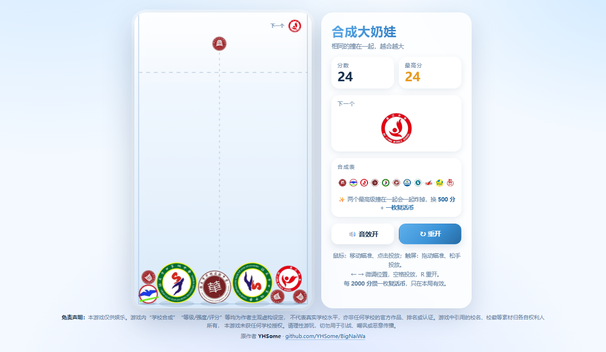

> [!CAUTION]
> # ️免责声明与娱乐提示
>
> 本游戏为个人制作的娱乐向小游戏，仅供休闲娱乐，不构成对任何学校的评价、排名、推荐、认证或官方合作。
>
> 游戏中出现的“XX学校合成XX学校”“等级”“强度”“评分”“稀有度”“品质”等内容，均为作者基于游戏玩法设定的主观虚构内容，不代表真实学校的办学水平、教学质量、社会声誉、录取难度或任何客观排名，也不应作为择校、升学、评价学校、攻击学校或引战的依据。
>
> 本游戏未获得任何学校、教育机构、政府部门或相关权利人的授权、认可或合作。游戏中引用的校名、校徽、校园名称及其他相关元素，其权利归各自权利人所有。本游戏对上述元素的使用仅为娱乐性引用，不表示与任何学校存在关联。
>
> 请玩家理性游玩，不要将游戏内容当真，也不要截图、转发、二次创作或传播用于嘲讽、引战、网暴、恶意比较或其他不当用途。因玩家不当使用、传播或解读引发的纠纷，由行为人自行承担相应责任。
>
> 如相关权利人认为本游戏内容存在不当，请通过 **[此处](https://github.com/Reforest8335/BigSI/issues)** 联系作者。作者将在核实后及时进行处理，包括但不限于修改、隐藏、替换或下架相关内容。

# 校徽碰碰乐

纯 **HTML + CSS + JavaScript** 的静态网页小游戏，零依赖、零构建、离线可玩。
物理引擎（PBD 位置约束求解）是自己写的，没有引入 matter.js 等任何第三方库。

> ### 这个仓库是什么
>
> 本项目是 **[YHSome/BigNaiWa](https://github.com/YHSome/BigNaiWa)** 的衍生版本。
> 游戏本体（自研 PBD 物理、按图片轮廓生成的碰撞箱、复活币与神奶蛙清场玩法、
> 两套真跑物理的自检脚本、以及下面绝大部分技术文档）都是**原作者 YHSome 写的**，
> 本仓库只做了这几件事：
>
> | 改动 | 说明 |
> | --- | --- |
> | 换素材 | 11 级换成校徽（`src/00.jpg`~`10.jpg`），新增 `tools/cutout_logos.py` 抠底 |
> | 换配色 | 由暖色（奶油/珊瑚红）整体改为冷色调 |
> | 加免责声明 | 进入弹窗（每次进入都要确认）+ 页脚常驻 |
> | 关排行榜 | 下线在线榜单，并移除含写入密钥的构建产物 |
> | 加掉落模式 | 可固定掉某一级（见「掉落模式」一节） |
> | 修问题 | 修掉若干审计出的高危/中危项，见 `AUDIT.md` |
>
> 原仓库用 MIT 之外的说明（「仅供学习娱乐使用」）。**原作者署名与链接见页脚与文末。**

## 🎮 在线玩

**<https://reforest8335.github.io/BigSI/>**

（GitHub Pages 托管，手机浏览器打开就能玩，也可以「添加到主屏幕」当 App 用。）

> **免责声明**：本游戏仅供娱乐。游戏内“学校合成”“等级/强度/评分”等均为作者主观虚构设定，
> 不代表真实学校水平，亦非任何学校的官方作品、排名或认证。游戏中引用的校名、校徽等素材
> 归各自权利人所有，本游戏未获任何学校授权。请理性游玩，切勿用于引战、嘲讽或恶意传播。
> 完整声明见游戏**进入时的弹窗**（每次进入都要确认一次）与页脚。



## 玩法

- 进入时会先弹**免责声明**，勾选「我阅读、理解并同意本声明」才能开始（每次进入都要确认一次）。
- **鼠标**：移动瞄准，点击即投放。
- **触屏**：按住拖动瞄准，**松手才投放**——手指不会挡住落点，也方便微调。
- 棋盘右上角的「下一个」是**下一颗**；当前这颗画在准星位置（虚线顶端）。
  投放后的冷却期间当前这颗会**变淡**显示（还不能投），这样两个位置始终各是各的，不会看混。
- 两个**同级别**的碰到一起就合成为高一级，并获得分数。
- 顶上虚线是**警戒线**：有块**卡在线的上方并且基本停住**、累计超过 1.5 秒即判负
  （被弹起来飞过线的不算，详见下面的「失败规则」）。
- 排行榜已**下线**，结束后不再上榜（见下方「排行榜」一节）。
- `←` `→` 微调位置，`Space` / `Enter` 投放，`R` 重新开始。
  （结束后空格/回车不再重开，避免手快连开新局。）
- 侧边栏「掉落：随机」按钮可以切换掉落模式，想让它一直掉同一个就点它（见下方「掉落模式」）。

素材链（11 级，按**文件名顺序**：`00` 最小 → `10` 最大）：

```
第1级 → 第2级 → 第3级 → 第4级 → 第5级 → 第6级 → 第7级 → 第8级 → 第9级 → 第10级 → 第11级
(00)    (01)    (02)    (03)    (04)    (05)    (06)    (07)    (08)    (09)     (10)
```

素材是真实学校校徽，但按作者要求**游戏内不显示校名**，一律称「第 N 级」。

合成得分采用三角数：1 / 3 / 6 / 10 / 15 / 21 / 28 / 36 / 45 / 55，
两个**最高级**撞在一起会一起炸掉，额外加 500 分、并送一枚复活币（后期唯一的泄压阀：两个最高级占满棋盘，不炸掉就没法继续玩）。

## 失败规则

**唯一判负条件：有块卡在警戒线上方、且基本停住，累计超过 1.5 秒。**

```js
const DANGER_Y   = 142;   // 警戒线
const OVER_LIMIT = 1.5;   // 累计秒数
const REST_SPEED = 140;   // 低于这个速度才算“卡住了”（px/s）

for (const b of balls) {
  if (b.dead || !b.landed) continue;         // 还没落地的不算
  if (b.y - b.r < DANGER_Y) {                // 这只在线上面
    if (b.vx*b.vx + b.vy*b.vy < REST_SPEED2) {
      b.overTime += dt;                      // 停住的才计时
      if (b.overTime > OVER_LIMIT) gameOver();
    } else {
      b.overTime -= dt * 2;                  // 正在飞 → 倒扣
    }
  } else {
    b.overTime -= dt * 2;                    // 回到线下方 → 倒扣（2 倍速）
  }
}
```

几个容易被误解的点：

| 疑问 | 答案 |
| --- | --- |
| **好几只轮流在线上方，时间会加在一起吗？** | **不会。** `overTime` 是**每只各自**的变量，必须**同一只**累计满 1.5 秒 |
| **被弹飞、路过线上的算吗？** | **不算。** 速度 ≥ 140px/s 时不计时，而且还在倒扣 |
| **贴着线上下反复弹会攒起来吗？** | 得看比例：线下方按 2 倍速扣，净变化率 = `3f − 2`（`f` = 在线上方的时间占比），**只有 f > 2/3 才攒得起来** |
| **会不会永远输不了？** | 不会。实测灌满棋盘第 161 次投放判负，那时堆顶 y=45、线上方 4 只里 3 只是静止的 |
| **除了这个还有别的失败条件吗？** | 没有。不限步数、不限数量、不限时间 |

想调：`DANGER_Y` 调高低、`OVER_LIMIT` 调容忍时间、`REST_SPEED` 调“多慢才算卡住”。
`node physics.test.js` 的第 7 组会把这三条规则各验一遍。

## 运行

线上直接开 <https://reforest8335.github.io/BigSI/>；
本地双击 `index.html` 即可（`file://` 协议下也能跑；排行榜已下线，所以不涉及网络请求）。
也可以起个静态服务：

```bash
npm run dev          # 等价于 python -m http.server 8137 --bind 127.0.0.1
# 或
python -m http.server 8080
# 打开 http://localhost:8080
```

部署：仓库打开 **Settings → Pages → Source = Deploy from a branch → main / (root)** 即可，
根目录已经放了 `.nojekyll`，静态文件原样发布。

## 打包成 exe（本地网页版）

给不想装环境的 Windows 用户准备了一条路：打成一个**双击就能跑**的便携包。
它是「本地起一个网页服务器 + 自动打开浏览器」，不是重写的桌面程序：

```bash
python tools/build_exe.py --name "校徽碰碰乐"
# 产物：dist\校徽碰碰乐\   （exe 约 2.2 MB，整个文件夹约 18.8 MB）
```

双击之后：弹出 cmd 窗口 → 自动打开浏览器 → 直接在网页里玩；
**关掉那个 cmd 窗口就是关掉整个程序**（服务一起停）。

```bat
校徽碰碰乐.exe                  :: 本机 52841 + 自动开浏览器
校徽碰碰乐.exe --port 52842     :: 换端口
校徽碰碰乐.exe --host 你的域名   :: 放行隧道域名（会自动打开绑定）
校徽碰碰乐.exe --lan            :: 允许局域网访问
校徽碰碰乐.exe --no-browser     :: 只起服务
```

实现上几个刻意的选择：

| 选择 | 原因 |
| --- | --- |
| 网页文件**打包时内嵌**进 exe（base64） | 不依赖同目录另放 `assets/`，整个文件夹拷到哪都能跑 |
| 只用 Python 标准库 | 没有第三方依赖，PyInstaller 打得小、也不容易出环境问题 |
| **`--onedir` 而不是 `--onefile`** | 见下面「为什么不写 C 盘」 |
| 默认只绑 `127.0.0.1` | 不主动把服务暴露到局域网；要分享得显式加 `--lan` |
| `Host` 头白名单 | 挡掉「把域名解析到 127.0.0.1」绕过同源策略的玩法。默认只认本机名；**挂自己的域名隧道要 `--host 你的域名`**（会自动打开绑定），`--lan` 额外放行局域网与常见隧道域名。被拦时会返回一个**写明域名和解决命令**的 403 页面 |
| 交互控制台需要活的 stdin | 关掉窗口 = 进程结束，符合"cmd 窗口就是程序本体"的直觉 |

### 为什么不写 C 盘（`--onedir` 的取舍）

实测过四种打包方式在 Windows 上的落盘行为：

| 方式 | 运行时解包到哪 |
| --- | --- |
| `--onefile`（默认） | `%TEMP%\_MEIxxxxxx` —— **C 盘，约 16.6 MB/次**，正常退出也删不掉，反复启动会堆积 |
| `--onefile --runtime-tmpdir 绝对路径` | 能指定目录，但路径被写死，exe 搬到别的机器就失效、静默回退到 Temp |
| `--onefile --runtime-tmpdir .` | 落当前工作目录；双击时正好是 exe 目录，但从别处启动（快捷方式改了"起始位置"、命令行）就乱 |
| **`--onedir`（当前采用）** | `exe 旁边的 _internal\`，**从任何工作目录启动都不写临时目录** ✓ |

> 顺带一个坑：`--runtime-tmpdir` **不能**写 `%~dp0`。bootloader 只是把该字符串
> 交给 Windows 展开环境变量，而 `%~dp0` 是批处理语法，那里认不出来，
> 会静默回退到 `%TEMP%` —— 试过，踩过。

代价：产物是一个文件夹而不是单文件。但它仍然是"双击 exe 就能玩"，
而且可以整个文件夹拷到 U 盘带走——换来的是一份确定的"数据不出这个目录"。

> exe 里**不内置** cloudflared 之类的隧道工具，隧道由使用者自己管理。
> 要挂隧道就用 `--host 你的域名`（或 `--lan`）起服务，再把 52841 端口挂出去。

## 开发

**运行时不装任何依赖**（`package.json` 里 `dependencies` 是空的，也没有打包步骤），
所以 `package.json` 只是一层命令别名：

```bash
npm test             # 跑两套自检（physics + gameplay）
npm run test:physics
npm run test:gameplay
npm run build:assets # 抠底 -> WebP -> 碰撞箱 -> 占位图，一条命令跑完
npm run build:parts  # 只重建碰撞箱，并导出两张验收图
npm run check        # 语法检查 + 两套自检
node tools/check_assets.js   # 素材与代码是否对得上（CI 里会跑）
```

素材脚本需要 **Python 3 + Pillow + numpy**：

```bash
pip install pillow numpy
```

CI 在 `.github/workflows/ci.yml`：Node 18/20/22 三个版本上跑语法检查、两套自检、
以及素材一致性检查。它存在的意义是把「改了素材但忘了重跑某个脚本」这类问题挡在合并前。

## 文件

| 文件 | 说明 |
| --- | --- |
| `index.html` | 页面结构：棋盘、结束遮罩、侧边面板、进入弹窗、页脚 |
| `style.css` | 全部样式：玻璃拟态面板、响应式布局、结束动画、弹窗（冷色调） |
| `game.js` | 游戏逻辑 + 自研物理 + Canvas 渲染 + WebAudio 音效 + 功能开关 + 掉落模式 |
| `disclaimer.js` | 进入时的免责声明弹窗（**每次进入都要确认**，不写 localStorage 记忆） |
| `assets/fruits/` | 校徽贴图：`00.png`~`10.png` 是 512×512 的抠底源图，页面实际加载的是同名 `.webp`；另有 `parts.js` 碰撞形状、`blur.js` 极模糊占位图 |
| `src/` | 校徽原始输入（`00.jpg`~`10.jpg`，白底），只作为脚本输入 |
| `src-old-fruits/` | 更早一版的水果实拍/插画素材，保留作历史参考，当前流程不用 |
| `tools/cutout_logos.py` | **校徽抠底**：四边连通生长 + 饱和度/亮度双闸门 + 边界覆盖率 alpha + 边缘借色 |
| `tools/optimize_sprites.py` | 把源图压成 WebP 并裁到每级实际需要的尺寸（2.56 MB → 0.22 MB） |
| `tools/make_blur.py` | 生成极模糊占位图 `blur.js`（11 张缩略图拼成一条、内联成 data URL，约 8 KB） |
| `tools/build_parts.py` | 生成碰撞体（自动选单圆/多圆包含体，保证可见轮廓被盖住、不穿模），产出 `assets/fruits/parts.js` |
| `tools/normalize_assets.py` | 给**旧水果素材**用的抠底脚本（`src-old-fruits/`），当前流程不用 |
| `tools/check_assets.js` | 素材一致性检查（贴图/碰撞箱/占位图/开关是否互相对得上），CI 里会跑 |
| `tools/build_exe.py` | 把网页打包成单个自包含 exe（`python tools/build_exe.py`） |
| `tools/launcher/run_local.py` | exe 的启动器源码：本地 HTTP 服务 + cmd 交互界面 |
| `tools/launcher/EXE-README.md` | 随 exe 一起给使用者的说明（打包后复制成 `使用说明.md`） |
| `physics.test.js` | 物理手感自检脚本（`node physics.test.js`） |
| `gameplay.test.js` | 复活 / 清场玩法自检（`node gameplay.test.js`） |
| `package.json` | 零依赖，只有 `test` / `dev` / `build:assets` 等脚本 |
| `.github/workflows/ci.yml` | CI：Node 18/20/22 上跑语法检查 + 两套自检 + 素材一致性检查 |
| `AUDIT.md` | 代码审计与开发路线图（含实测性能数据、历史考古、后续建议） |
| `preview.png` | 预览图 |

### 功能开关（`game.js` 顶部）

| 常量 | 当前值 | 作用 |
| --- | --- | --- |
| `LEADERBOARD_ENABLED` | `false` | 关掉后结算不提交任何成绩，排行榜脚本也不再加载 |
| `SPONSOR_ENABLED` | `false` | 赞助弹窗已下线，改成页脚署名 + 原作者 GitHub 链接 |

## 掉落模式

侧边栏的「掉落：随机」按钮点一下换一个模式，**选择会记在 localStorage**，刷新后保持。
也可以直接在控制台改：

```js
__DNW__.setDropMode('max')      // 一直掉最高级（第 11 级）—— 想合出大的就点这个
__DNW__.setDropMode('fixed')    // 一直掉固定级别
__DNW__.setFixedTier(4)         // 把「固定级别」设成第 5 级，并切到 fixed
__DNW__.setDropMode('cycle')    // 第1、2、3…11 级依次轮着掉（一次看全所有级别）
__DNW__.setDropMode('noRepeat') // 随机，但严格避开上一颗
__DNW__.setDropMode('random')   // 恢复默认的加权随机
```

| 模式 | 行为 |
| --- | --- |
| `random` | 默认：前 5 级按权重 `[.28 .24 .20 .16 .12]` 加权随机 |
| `max` | 永远掉第 11 级（最高级） |
| `fixed` | 永远掉 `dropModeRef.fixedTier` 指定的那一级 |
| `cycle` | 按 0→10 依次轮换，到顶回到 0 |
| `noRepeat` | 加权随机，但保证不与上一颗相同 |

切换模式后，「当前这颗」和「下一个」会立刻按新模式刷新，不用重开一局。
改动点在 `game.js` 的 `dropModeRef` / `rollSpawnTier()` / `pickSpawnTier()`。
不想让模式被记住，就删掉 `boot()` 里的 `loadDropMode()` 调用。

## 素材（当前是校徽）

11 级按**文件名顺序**对应：`00` = 第 1 级（最小最常见），`10` = 第 11 级（最大）。按作者要求**不显示校名**，游戏内一律称「第 N 级」。

原始输入放在 `src/00.jpg`~`10.jpg`（白底）。**换素材的完整流程**：

```bash
# 一次跑完整条链（等价于下面 4 步）
npm run build:assets

# 1) 抠底：白底 -> 透明 PNG，输出 assets/fruits/NN.png
python tools/cutout_logos.py --preview     # --preview 导出 _cutout_preview.png 验收图
# 2) 压成 WebP 并按每级实际显示尺寸裁切（2r/0.92 的 2 倍图，给 DPR≤2 用）
python tools/optimize_sprites.py
# 3) 重新生成碰撞形状（换了素材必须跑，因为要读新的 alpha）
python tools/build_parts.py --mode auto --envelope-margin 4 --max-parts 90 --preview
# 4) 重新生成极模糊占位图（它按 game.js 里的贴图路径和顺序生成）
python tools/make_blur.py

# 最后确认一遍素材和代码是否对得上（这一步能抓出"忘了重跑某个脚本"）
node tools/check_assets.js
```
```

> 顺序不能乱：`build_parts.py` 读 PNG 的 alpha，`optimize_sprites.py` 读 PNG 出 WebP，
> `make_blur.py` 读 WebP 且**顺序取自 `game.js` 的 `FRUITS` 表** —— 所以改完 `game.js`
> 的贴图路径后一定要重跑第 4 步，否则占位图和真实贴图会错位。

### 抠校徽和抠块有什么不一样

`tools/normalize_assets.py` 是为块插画写的：主体是实心色块，**白色一定是背景**。
校徽不行 —— 圆环里还有白色文字和白色内圈（例如红环里的白字「曲江中学」），
把白色一概当背景会把字挖空。所以 `tools/cutout_logos.py` 用了**双闸门**：

| 闸门 | 作用 |
| --- | --- |
| `sat_max = 0.08` | 饱和度高于它的像素永不算背景 → 保住彩色圆环的边缘 |
| `val_min = 244` | 最暗通道低于它的像素永不算背景 → 保住白色文字/白色内圈 |

背景判定仍然是「从画布四边向内连通生长」，所以被彩色圆环围住的中心白区不会被吃到
（和外面不连通），白字也不会被吃（不连通 + 双闸门双保险）。实测 11 张全部保住白字。

烤暗边的步骤在这一版**没有做**：原来的 `bake_rim()` 是给浅色块垫一圈棕色投影用的，
校徽本身颜色深、对比够，再加暗边反而显脏。

### 本轮素材的碰撞体数据

```
tier        0    1    2    3    4    5    6    7    8    9   10
形状     包含圆 包含体 包含体 包含体 包含圆 包含体 包含体 包含圆 包含体 包含体 包含体
圆个数     1   40   21   15    1   11   82    1   42   51   90
IoU     .842 .969 .970 .979 .897 .975 .891 .949 .941 .958 .854
可钻深度(源图px) 0  29.8 15.1  7.4  0   11.3  6.2  0   14.5  7.7  7.1
```

`可钻深度` = 可见轮廓里没被碰撞体盖住的部分**最深能钻多深**。
0 表示完全不穿模；非 0 的是几个像素级的小缺口（换算到世界约 1~8px），
远小于「单圆包含体」在凹处要胖出的 17~60px，所以看不出来。

> **为什么不直接用单圆**：圆必须罩住整个外接轮廓，凹进去的方向就会多出一大块。
> 实测 tier8/9/10 的单圆平均胖出 **35/17/20px**（最大 60px），球之间会有明显半透明的缝。
> 而多圆包含体只在几处留 1~8px 的小缺口 —— 两害相权取轻。
>
> **`auto` 模式的选择逻辑**（`build_parts.py`）：单圆和多圆各算一遍，
> 可钻深度超过 `MAX_HOLE_DEPTH_PX`（34 源图px）就退回绝对安全的单圆；
> 单圆本来就够贴合（IoU ≥ 0.93）时也不换多圆（圆数是物理耗时的平方项）。
>
> **旧方案（`--mode outline`）为什么不行**：按轮廓取**内接**小圆，圆与圆之间必然留缝，
> 实测可见面积有 **2.6~29.5% 完全没有碰撞箱**（tier10 最严重），
> 于是小球能钻进大球的凹口、大的把小的包住，越大越明显。这就是要修的那个 bug。

`build_parts.py --preview` 会导出两张验收图：

- `_parts_preview.png`：**源图轮廓** vs 碰撞箱（红/绿/黄）
- `_align_preview.png`：**玩家实际看到的贴图**（按 `2r/0.92` 绘制）vs 碰撞箱

后者才是真正该看的那张 —— 它验证的是「视觉大小 = 物理大小」这个 `ASSET_FILL` 契约，
并会打印每级的「贴图最远 / 碰撞最远 / 差值」。判定标准：

```
差值为负        贴图被碰撞箱完全包住 → 安全（不会穿模）
差值为正        碰撞箱比贴图小 → 会露出可以钻进去的缝，必须修
```

## 排行榜（已下线）

**状态：已下线，构建产物已移除。** 具体做了三件事：

1. `index.html` 不再加载排行榜脚本；
2. `game.js` 的 `LEADERBOARD_ENABLED = false` 让结算不再调用 `onGameOver`；
3. 删掉了 `leaderboard.min.js` —— 那份产物里编码着一个**仍然有效的写入密钥**
   （XOR 混淆，key 就写在同一个文件里，机械还原只要三行代码）。
   纯静态站没法藏住写入凭据，留在公开仓库等于把榜单交给任何人。

**没有任何对外网络请求。** 结算页只留「再来一局」。

想恢复的话：别直接把写入放回客户端，建议**加一个服务端代理**
（Cloudflare Worker / Deno Deploy 之类的免费额度足够），客户端只发 `{name, score}`，
由服务端持有真实密钥并做速率限制与合理性校验。旧实现可以从 git 历史取回
（`861b487` 那次提交之前有 366 行的完整源码 `leaderboard.js` 和构建脚本
`tools/minify-leaderboard.py`）。

下面是原本的设计，只留要点备查（完整的接口细节和源码已随排行榜一起移除，
需要的话去原仓库 <https://github.com/YHSome/BigNaiWa> 或本仓库的 git 历史里看）——

用的是 **TinyWebDB** —— 一个给 App Inventor 用的极简 key-value 云存储，
靠 POST 表单调用，跨域头是 `Access-Control-Allow-Origin: *`，
所以纯静态页也能直接读写，不需要自建后端。

| 项 | 值 |
| --- | --- |
| 用到的 action | `update`（写）、`search`（按 tag 前缀读） |
| tag | `<前缀>_<时间戳36进制>_<随机4位>` |
| value | `{"n":"昵称","s":分数,"t":时间戳}` |

**榜单内容 = 最近 20 次提交**（服务端按提交时间倒序返回，取最新两页就够覆盖）。
这个设计的用意是：**榜单是一条滚动的时间窗，不是历史最高分榜**——分数只在自己还在窗口里的
那段时间有效，后来的人会不断把你挤出去，所以卡在榜首或者长期占位没有意义。

**结算流程**（原来是打完自动上榜，不需要手动点提交）：

1. 游戏结束 → 直接提交，昵称取 `localStorage` 里存的，**没填就用「默认用户」**；
2. 提交成功 → 重新读一次榜单，把窗口内的排名显示出来；
3. 提交失败 → 显示错误并给一个「重试提交」按钮。

从头到尾**只写自己那条记录，不读也不动别人的数据**：没有任何 `delete`，
旧成绩是自然被挤出时间窗的，不是被清掉的。

实现上的几个小处理（这些经验对以后真要做排行榜仍然有用）：

- **昵称**存 `localStorage`，去掉控制字符、限长 12 字，空串一律当「默认用户」；
- **防手抖**：自动提交时校验「两次提交至少间隔 3 秒」，0 分不上榜，分数离谱的不收；
- **不抢按键**：焦点在输入框里时，`game.js` 的键盘处理直接让路（不然打字会掉块）；
- **容错**：网络不通只是排行榜打不开，游戏照常玩；接口偶发 502 会自动重试一次；
- **XSS**：榜单全部用 `textContent` 渲染，不拼 HTML。

> ⚠️ 历史教训：这个排行榜曾经为了防刷榜做过「按分数阈值静默删榜」和「每 5 次读榜删掉榜首一条」，
> 后来都撤掉了（改成上面的时间窗）。**在客户端做服务端的事，注定要绕这种弯** ——
> 这也是本仓库最终选择把它整个下线的原因。

## 碰撞形状（可见轮廓的超集）

**每一级的碰撞体由 `tools/build_parts.py` 从贴图 alpha 生成**，写出 `assets/fruits/parts.js`：

```js
window.SUIKA_PARTS = [
  { parts: [[ox, oy, s]], rb: 1.15, hole: 0 },   // 单圆：以质心为心、包含整个可见轮廓
  ...
];
// parts = [ox, oy, s]，单位是「以 r 为 1」；rb = 包围圆半径（快速粗筛用）；
// hole = 可见轮廓中**没有被碰撞体盖住**的面积占比（%，0 = 完全不穿模）
```

游戏里球的碰撞就是这个圆（或若干子圆）：

| 环节 | 做法 |
| --- | --- |
| 粗筛 | 两个块的包围圆 `rb` 不相交直接跳过 |
| 球球 | 子圆两两求交，取**最深/最近的那一对**产生法线与修正量，推力按逆质量分配到刚体中心 |
| 合成 | 任意一对子圆「贴上」（含 0.8px 容差）即合成 |
| 撞墙 | 每个子圆各自贴墙，取各方向最深穿透量一次性加到刚体中心上 |

`parts.js` 缺失或某级没数据时，自动退回成单圆（半径 r），不会白屏。

### 为什么必须用「包含体」而不是「按轮廓内接小圆」

**内接圆方案必然穿模，这是几何上绕不开的**：内接圆之间一定留缝，而可见轮廓
总有一部分落在缝里 —— 小球就能钻进大球的凹口、大的把小的包住，而且越大越明显。
实测：

| 方案 | 可见轮廓"没有碰撞箱"的面积 | 后果 |
| --- | --- | --- |
| 内接小圆（旧） | 2.6% ~ **29.5%**（tier10 最严重） | 小球钻进大球、被包住 |
| 多圆包含体（现用） | 0.1% ~ 0.7%，且缺口只有 1~8px 深 | 看不出穿模 |
| 单圆包含圆 | 0% | 安全，但在凹处胖出 17~60px |

现用方案：**把可见轮廓外扩 `--envelope-margin` 个源图像素，再在「可见轮廓」上按需铺圆，
圆半径取「到外扩边界」的距离** —— 于是每颗圆都比它盖住的那块可见区域大一点，
并集自然包含可见轮廓，圆心又能贴着轮廓分布（不像单个包含圆那样在凹处胖出一大块）。
`auto` 模式会在单圆和多圆之间自动挑（见上一节的判据）。

> 想复现旧行为（会穿模）做对比：`python tools/build_parts.py --mode outline`
> 想看单圆包含体：`python tools/build_parts.py --mode containing`

重新生成（换了贴图之后跑一次）：

```bash
python tools/build_parts.py --mode auto --envelope-margin 4 --max-parts 90 --preview
# --preview 导出两张验收图：
#   _parts_preview.png  红=源图轮廓  绿=碰撞箱  黄=重合
#   _align_preview.png  红=实际贴图  绿=碰撞箱  黄=重合
```

成本：实测 `stepPhysics` 单子步 × 3 子步 = 一帧 ——

| 在场块数 | 现用（auto，355 圆/11 级） | 单圆包含体 | 旧内接（32~64 圆） |
| --- | --- | --- | --- |
| 12 | 0.132 ms | 0.099 ms | 0.208 ms |
| 20 | 0.505 ms | 0.284 ms | 0.494 ms |
| 30（密堆） | **1.146 ms** | 0.530 ms | 0.737 ms |

60fps 预算是 16.7ms，余量仍然充足。手机（尤其低端安卓）通常再慢 2~3 倍。
**圆数对耗时是平方关系**，所以 `--max-parts` 别随意加大（试过 150，30 球要 4.2ms）。

### 关于「抖动 / 震动 / 开关没反馈」

三个来源分别处理过：

1. **帧循环丢时间导致的周期性顿挫**（看起来像抖动）。
   原来 `if (guard >= 5) acc = 0;` 在追不上 60fps 时会直接丢弃攒下的时间，
   手机掉到 30fps 时几乎每帧都触发 —— 每帧丢一点时间就表现为一顿一顿。
   现在改成**封顶保留 1 帧**，慢机器上是"整体节奏略慢"而不是"抖动"。
2. **手机马达震动"不对等"**。原实现 `haptic(6 + 级别)` 让同样的"合成成功"
   级别不同震感差一倍（第1级 7ms、第9级 15ms）；而且 `navigator.vibrate()`
   是**替换**语义，连续合成时后一次的短震会掐断前一次，同一级别也会时轻时重。
   现在按**档位**给固定时长（普通 9ms / 大级别 13ms / 最高级合体 18ms / 结束 60ms），
   并做 45ms 合流：窗口内只保留最强的一次，避免互相掐断。
3. **开关没有反馈**。手机上点「音效」只是换个小图标、点「掉落模式」只换个 emoji，
   根本不知道切成了什么。现在两者都会在棋盘上弹一条**药丸提示**，例如
   `👑 掉落：一直掉最高级（第 11 级）`，1.5 秒后自动消失，同一时刻只留一条。
4. **球卡死在别人里面、永远抖**（这个最隐蔽，是靠数值诊断抓出来的）。
   球球约束只在**子圆相交**时给出法线；当小球整颗落进大球的碰撞轮廓内部，
   它的所有子圆都在大球内部，交集退化，求解器拿不到可靠的向外方向；
   如果旁边还有墙推着它，就会永远卡在里面以几百 px/s 抖动。
   实测：tier2 小球卡在 tier10 里，`中心距/大球半径 = 0.56`，速度 **266px/s 不衰减**。
   现在每轮迭代后面加了一段**解包（de-engulf）**：中心距小于大球包围圆半径的 90%
   时，直接把小的那颗推到包围圆外（按逆质量，只推小的，避免连锁塌方）。
   修完之后同一场景：**0.01px/s，完全静止**，`最小 中心距/大球半径 = 1.14`。

震动开关：`HAPTIC_ENABLED`（`game.js` 顶部，改 `false` 即完全关闭），它仍然跟随静音开关。
**音效默认关闭**（`MUTE_DEFAULT = true`）—— 很多人是在公共场合点开的，
突然出声很尴尬；玩家主动打开后会被记住。

`node physics.test.js` 里量过：静止盘面的逐帧位移 **0.0001px/帧**（等于不抖）。

## 素材加载与回退（三级）

每个级别的贴图**棋盘、下一个预览、合成表、粒子全部复用同一张**，不需要多倍图
（不同尺寸由 canvas 缩放，打包时按 `2r/0.92` 的 2 倍裁，正好覆盖 DPR≤2）。

`game.js` 的 `loadSprites()` 对每张图**失败会退避重试 3 次**（弱网下一次拉不到很常见），
重试时换个带参 URL 绕开浏览器的失败缓存，并且必须等 `img.decode()` 完成才交给 `drawImage`。

**回退顺序是三级**，别让玩家看到"图挂了"：

1. 贴图到位 → 正常画
2. 还没到 / 失败了 → 画 `blur.js` 里那张**极模糊的同形状缩略图**（内联 data URL，零请求，约 8 KB），
   观感是"图正在慢慢变清晰"
3. 连 `blur.js` 都没有（被拦了）→ 才画程序化的圆形占位徽章（`FRUITS[i].c1/c2`）

**缺图不影响游玩**：任何一张加载失败都会走上面第 2/3 级回退，不会白屏也不会报错。

## 实现要点

- **物理**：位置约束求解（PBD）。每帧 3 个子步 × 6 次迭代，
  每个块带一组按图片轮廓生成的子圆（见上一节），
  速度由位置差反推 —— 堆叠稳定、不抖动，且能正确处理 124px 的第 11 级压在 17px 的第 1 级上的极端质量比。
- **Q 弹回弹**：位置约束会把法向速度吃掉，所以在每个子步末尾额外做一次弹性冲量，
  把法向相对速度直接改写成 `e × 碰撞前速度`（球球 `e=0.38`、墙 `e=0.45`），
  回弹量只由 `e` 决定、不受子步/迭代次数影响。
  撞速低于 `REST_THRESHOLD` 时完全不弹，所以静止堆叠依然零抖动：
  从顶部掉落的块能弹起约 110px、连弹 5 次才停。
  另外撞击时按法线做挤压变形（压扁 + 垂直拉伸，0.4 秒回弹），果冻感更强。
- **合成判定**：接触容差 0.8px，同级别贴身即合，手感跟手；
  合成只在每个子步的第 0 次迭代判定一次，避免重复合成。
- **渲染**：整体按 devicePixelRatio 缩放。有贴图就画贴图（`box = 2r / 0.92`，
  保证**视觉大小 = 物理直径**，四边不会露馅），没贴图就画程序化占位徽章。
  贴图跟着 `b.angle` 一起旋转，和物理滚动一致；撞击时的挤压变形同样作用于贴图。
  合成时有粒子爆裂、飘分文字与新品弹出动画。
- **素材加载**：等 `img.decode()` 完成才交给 `drawImage`，避免画出没解码完的半成品。
- **音效**：WebAudio 振荡器实时合成，无音频文件；可一键静音并记忆设置。
- **存档**：最高分与静音状态存 `localStorage`。
- **调试**：控制台可用 `__SUIKA__.state`、`__SUIKA__.reset()`、`__SUIKA__.drop()`、
  `__SUIKA__.FRUITS`、`__SUIKA__.render()`。

## 物理自检

```bash
node physics.test.js
```

用桩件模拟 DOM/Canvas，在 Node 里跑真物理（连 `parts.js` 一起加载，用的是真实碰撞形状），覆盖：
自由落体回弹高度、球对球弹起、12 秒堆叠稳定性（残余速度 / 漂移 / 穿墙 / NaN）、
**静止后形状之间无穿透**、自动投放 60 次不走样、
触屏「拖动瞄准 / 松手投放」与鼠标「按下即投」两套输入、
**结束后空格/回车不再重开而 R 可以、输入框里不抢按键**。

```bash
python tools/build_parts.py --max-parts 16 --preview   # 换了贴图后重新生成碰撞形状
node physics.test.js                                   # 物理自检
```

## 手机端适配

| 项 | 做法 |
| --- | --- |
| 布局 | 窄屏（≤860px）下 `.panel` 用 `order:-1` 提到棋盘上方，横过来压成**顶部信息条**：左边分数、右边按钮，标题/合成表/提示收起 |
| 棋盘尺寸 | `height: min(可用高度, 96vw × 700/420)`，宽度由 `aspect-ratio` 反推 —— 不拉伸、不溢出，任何机型都不出滚动条 |
| 视口高度 | 用 `100dvh`（带 `100vh` 回退），避开手机地址栏吃掉高度的问题 |
| 安全区 | `padding` 叠 `env(safe-area-inset-*)`，刘海 / 小白条不会压住内容 |
| 触控 | 棋盘 `touch-action:none`；`body` 上 `touch-action:manipulation` + `overscroll-behavior:none`，干掉双击缩放和下拉刷新 |
| 按钮 | 最小 46px 高、带内边距，小屏（≤380px）再压一档；`pointerdown` 时 `setPointerCapture`，手指滑出棋盘也能收到 `pointerup` |
| 反馈 | 合成时按等级给 `navigator.vibrate` 轻震（跟随静音开关） |
| 性能 | canvas 内部分辨率按 `devicePixelRatio` 缩放但**封顶 2×**，高分屏不炸填充率 |
| 弹窗 | 结束弹窗按钮撑满宽度、加大触摸目标 |

横屏（`orientation: landscape`）自动切回左右布局：棋盘占满高度、信息条竖排在右侧。

## 参数速查（`game.js` 顶部）

| 常量 | 默认值 | 作用 |
| --- | --- | --- |
| `GRAVITY` | `2600` | 重力加速度 px/s² |
| `SUBSTEPS` / `ITER` | `3` / `6` | 物理精度，调高更稳更费 CPU |
| `RESTITUTION` | `0.38` | 球与球之间的弹性，调大更弹 |
| `WALL_RESTITUTION` | `0.45` | 撞墙 / 撞地面的弹性 |
| `REST_THRESHOLD` | `55` | 撞速低于此值不反弹（保堆叠稳定） |
| `FRICTION` | `0.955` | 接触切向摩擦，调小更滑、调大更快停住 |
| `SQUASH_MAX` / `SQUASH_DECAY` | `0.30` / `9` | 撞击挤压的最大变形与回弹速度 |
| `DROP_MS` | `360` | 两次投放的最小间隔 |
| `OVER_LIMIT` | `1.5` | 卡在警戒线上方多少秒判负 |
| `DANGER_Y` | `142` | 警戒线高度 |
| `REST_SPEED` | `140` | 低于这个速度才算“卡住了”，飞过去的不计时 |
| `MERGE_PAD` | `0.8` | 合成接触容差（子圆之间） |
| `AVOID_REPEAT` | `true` | 「下一个」避开与当前相同的等级（改成 `false` 恢复完全随机，会有 ~22% 概率两边同图） |
| `SPAWN_WEIGHTS` | `[.28 .24 .20 .16 .12]` | 前 5 级的掉落权重；开了 `AVOID_REPEAT` 后实测摊平为 25.6/23.2/20.6/17.2/13.4% |
| `dropModeRef.value` | `'random'` | 掉落模式：`random` / `max` / `fixed` / `cycle` / `noRepeat`（见「掉落模式」） |
| `dropModeRef.fixedTier` | `0` | `fixed` 模式掉哪一级 |
| `ASSET_FILL` | `0.92` | 贴图主体占画布比例，**必须与生成脚本的 `FILL` 一致** |
| `FRUITS` | 11 项 | 每级的半径 / 贴图路径 / 兜底配色，改这里即可换皮 |
| `FRUITS[i].c1/c2` | 11 组 | 贴图缺失时的程序化占位徽章配色 |
| `FRUITS[i].pc1/pc2` | 11 组 | 粒子/汁水颜色（取自贴图主体平均色） |

> 判负用的是**碰撞外形的真实上边缘**（`topEdge()`），不是 `y - r`。
> 因为碰撞箱是按贴图轮廓生成的，上边缘与标称半径差几个像素（实测包围圆半径在 0.99~1.13 r），
> 用圆去判会和玩家看到的边缘不一致。


## 参考的开源项目

本项目的玩法与素材链设计参考了以下开源实现（代码为原仓库原创，未复制其源码）：

- [Ikapricity/daxigua](https://github.com/Ikapricity/daxigua) — 合成大西瓜未修改版本源码，可直接在浏览器运行
- [CaptainAries/dxg](https://github.com/CaptainAries/dxg)
- [moonfloof/suika-game](https://github.com/moonfloof/suika-game) — 使用 matter.js 的英文版克隆
- [IceburgLettuce17/suika-game-js-beta](https://github.com/IceburgLettuce17/suika-game-js-beta)

## 许可与出处

游戏本体来自 **[YHSome/BigNaiWa](https://github.com/YHSome/BigNaiWa)**，作者 **YHSome**。
原仓库的说明是「仅供学习娱乐使用」。

本衍生版本沿用同样的定位：**仅供学习娱乐使用**。
二次分发或修改时请保留原作者署名与上面这个链接。

### 校徽素材声明

游戏中引用的校名、校徽、校园名称及其他相关元素，**其权利归各自权利人所有**。
本游戏未获得任何学校、教育机构、政府部门或相关权利人的授权、认可或合作，
对上述元素的使用仅为娱乐性引用，不表示与任何学校存在关联。

本游戏不构成对任何学校的评价、排名、推荐、认证或官方合作。游戏内的
「等级 / 强度 / 评分 / 稀有度 / 品质」等均为作者基于玩法设定的**主观虚构内容**，
不代表真实学校的办学水平、教学质量、社会声誉、录取难度或任何客观排名，
也不应作为择校、升学、评价学校、攻击学校或引战的依据。

请理性游玩，切勿用于引战、嘲讽、网暴、恶意比较或传播。

**权利人如需下架、或有任何异议：**
请在 **[此处](https://github.com/Reforest8335/BigSI/issues)** 提一个 issue 说明情况，
作者会在核实后及时处理，包括但不限于修改、隐藏、替换或下架相关内容。
